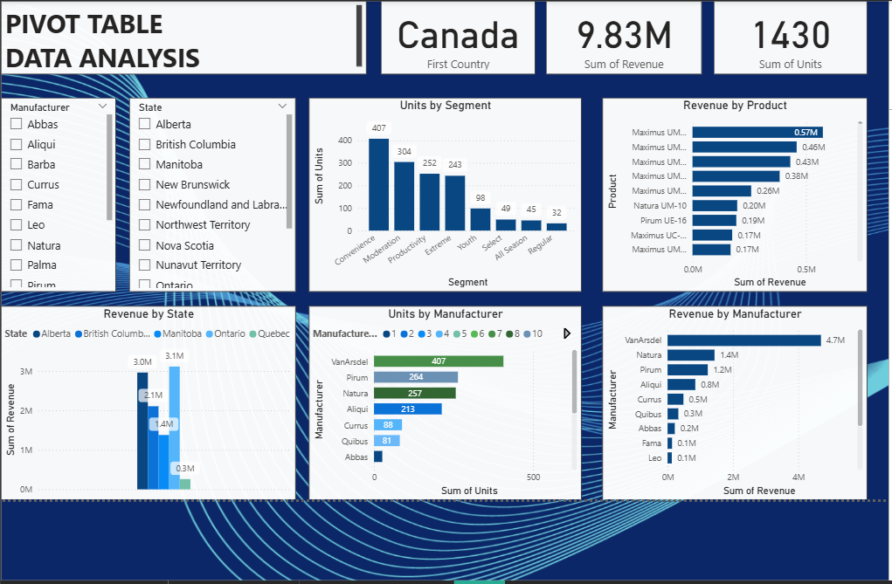

# Pivot_Data_Power_BI
# 📊 Power BI Dashboard – Pivot Table Data Analysis (Canada Region)

## 🧭 Overview
This Power BI project provides an interactive data analysis of sales performance across **Canadian provinces**, **manufacturers**, **product segments**, and **individual products**.  
The dashboard leverages pivot tables and dynamic visuals to help executives gain clear insights into revenue trends, product performance, and market opportunities.

---

## 📈 Key Metrics
| Metric | Value |
|---------|--------|
| **Country** | Canada |
| **Total Revenue** | 💰 9.83 Million |
| **Total Units Sold** | 📦 1,430 Units |

---

## 🧩 Dashboard Highlights

### **1. Revenue by Manufacturer**
- **VanArsdel** dominates with **$4.7M** (≈48% of total revenue).  
- **Natura ($1.4M)** and **Pirum ($1.2M)** follow as strong contributors.  
- Top 4 manufacturers account for **80% of total sales**, showing market concentration.

### **2. Revenue by State**
- Highest revenue in:
  - **British Columbia – $3.1M**
  - **Alberta – $3.0M**
  - **Manitoba – $2.1M**
- **Quebec ($0.3M)** remains underpenetrated.

### **3. Segment Performance**
- **Convenience** and **Moderate** segments lead in unit sales.
- Underperforming segments (**Youth, Select, All Season, Regular**) need renewed strategies.

### **4. Product Revenue**
- **Maximus UM** product line dominates sales, led by **Maximus UM-01 ($0.57M)**.
- Other strong products: **Natura UM-10** and **Pirum UE-16**.

### **5. Units by Manufacturer**
- Top contributors: **VanArsdel (407 units)**, **Pirum (264 units)**, **Natura (257 units)**.
- Smaller brands show minimal contribution, highlighting potential for repositioning.

---

## 💡 Strategic Insights & Recommendations

1. **Expand in High-Growth Provinces**  
   Focus marketing and logistics in **British Columbia**, **Alberta**, and **Manitoba**.

2. **Strengthen Key Manufacturer Partnerships**  
   Deepen collaboration with **VanArsdel**, **Natura**, and **Pirum** through joint promotions and exclusive deals.

3. **Product Optimization**  
   Continue investment in high-performing **Maximus UM** line.  
   Reassess underperforming SKUs for rebranding or discontinuation.

4. **Segment Targeting**  
   Allocate marketing spend toward **Convenience** and **Moderate** segments.  
   Design tailored offers for low-performing customer segments.

5. **Eastern Market Growth**  
   Develop focused strategies for **Ontario** and **Quebec** to diversify revenue distribution.

---

## 🧠 Tools & Technologies
- **Microsoft Power BI**
- **Excel Pivot Tables**
- **Data Visualization & DAX**
- **Sales & Revenue Analysis**
- **Business Intelligence Reporting**

---

## 📂 Files Included
- `PowerBI_Dashboard.png` – Screenshot of the final Power BI dashboard  
- `README.md` – Project documentation  
- *(Optional)* `.pbix` file – Power BI source file (if you wish to include it)

---

## 🚀 How to Use
1. Open the Power BI report (`.pbix` file) in Power BI Desktop.  
2. Explore filters for **Manufacturer**, **State**, and **Segment**.  
3. Interact with visuals to analyze **revenue**, **units sold**, and **product performance** across regions.  
4. Use insights to support data-driven executive decisions.

---

## 🏷️ License
This project is released under the [MIT License](LICENSE).  
Feel free to use and modify with attribution.

---

## 🖼️ Dashboard Preview

---

> *"Turning data into actionable insights through interactive Power BI dashboards."*
